# 古诗词学习微信小程序（服务端）

- 本项目为古诗词学习小程序的服务端部分（前端部分github地址：[poem-game-mini-program-client](https://github.com/delaprada/poem-game-mini-program-client)）

- 服务端是用Node.js写的

- 项目使用的技术方案为：Egg.js + Sequelize + MySQL

- 古诗词数据源来自[chiness-poetry](https://github.com/chinese-poetry/chinese-poetry)开源仓库，以及对应的mysql格式数据[chinese-poetry-mysql](https://github.com/KomaBeyond/chinese-poetry-mysql)开源仓库。以上数据源的诗词均为繁体字，本项目基于数据源对数据进行简体化。

## 使用

克隆项目到本地：

```javascript
git clone https://github.com/delaprada/poem-game-mini-program-server.git
```

更改数据库配置：

```javascript
config.sequelize = {
  dialect: 'mysql',
  host: 'localhost',
  port: 3306,
  database: 'miniprogram',
  username: '数据库用户名',
  password: '数据库密码',
};
```

更改阿里云存储配置：

```javascript
let aliInfo = {
  // https://help.aliyun.com/document_detail/31837.html
  region: '阿里云region',
  bucket: '阿里云存储桶名称',
  accessKeyId: '阿里云accessKeyId',
  accessKeySecret: '阿里云KeySecret',
};
```

安装依赖并启动项目：

```javascript
npm install
npm run dev
```

可以本地访问`http://127.0.0.1:7001`测试接口，与前端[poem-game-mini-program-client](https://github.com/delaprada/poem-game-mini-program-client)交互

## 功能列表

- [x] 首页
  
- [x] 搜索

- [x] 登录
  
- [x] 诗词详情
  
- [x] 诗人详情

- [x] 喜爱、收藏诗词

- [x] 诗词试听音频获取

- [x] 诗词朗诵录音上传云存储，存入数据库

## 项目截图

|  首页   | 诗词详情  |  诗人详情   |
|  ----  | ----  | ----  |
| 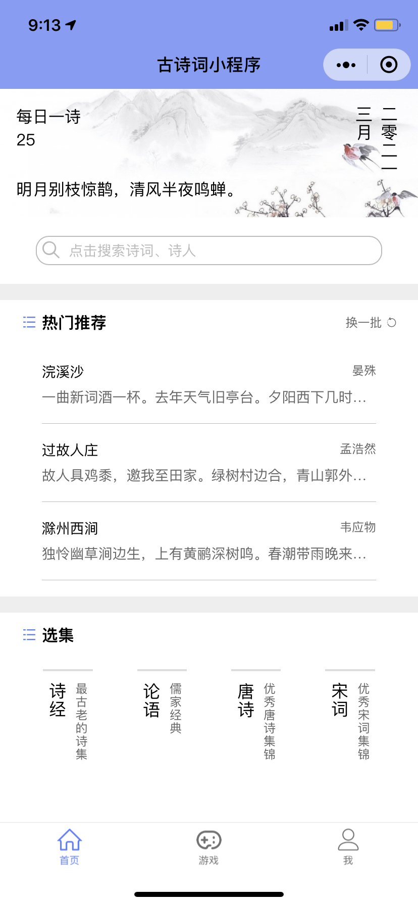  | 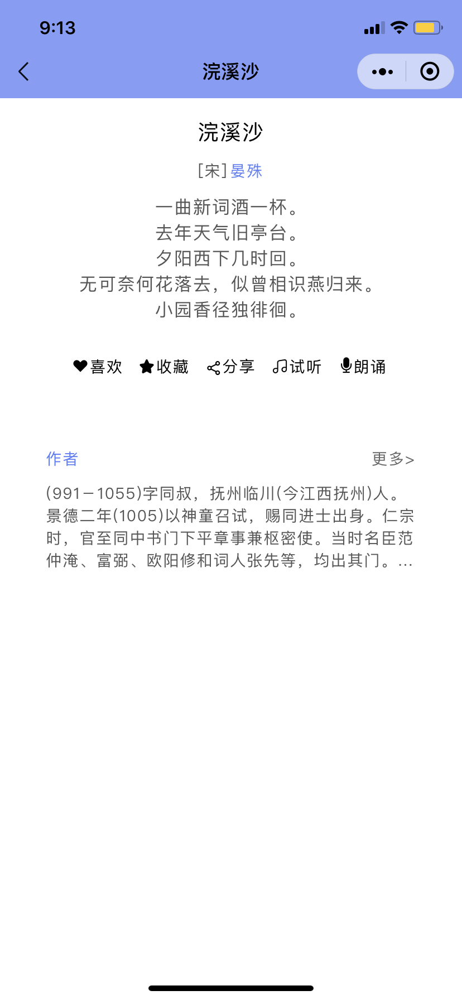 |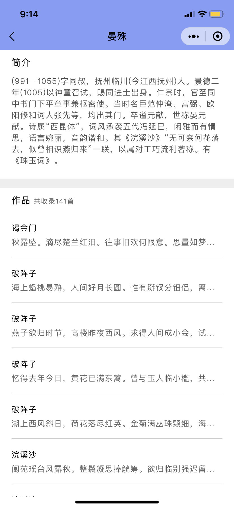|
|  诗词列表   | 诗词试听  | 诗词朗诵 |
| 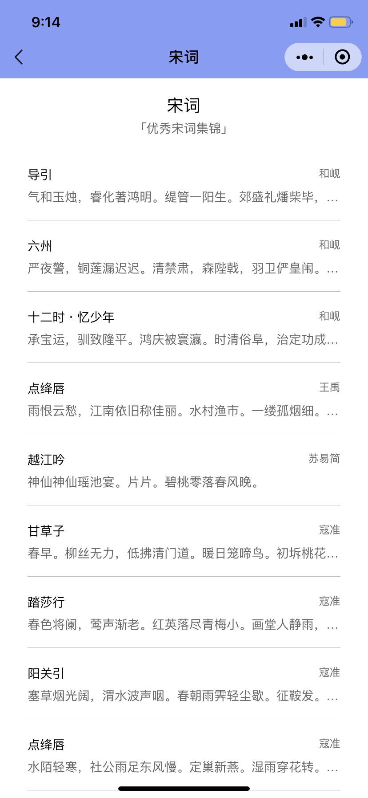  | 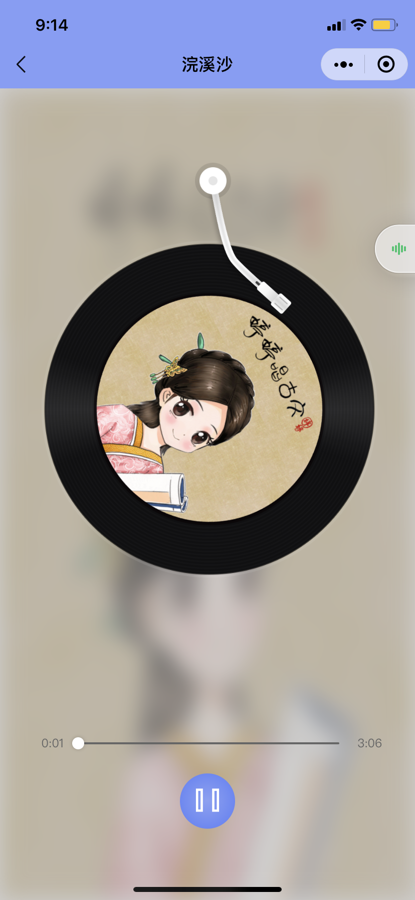 |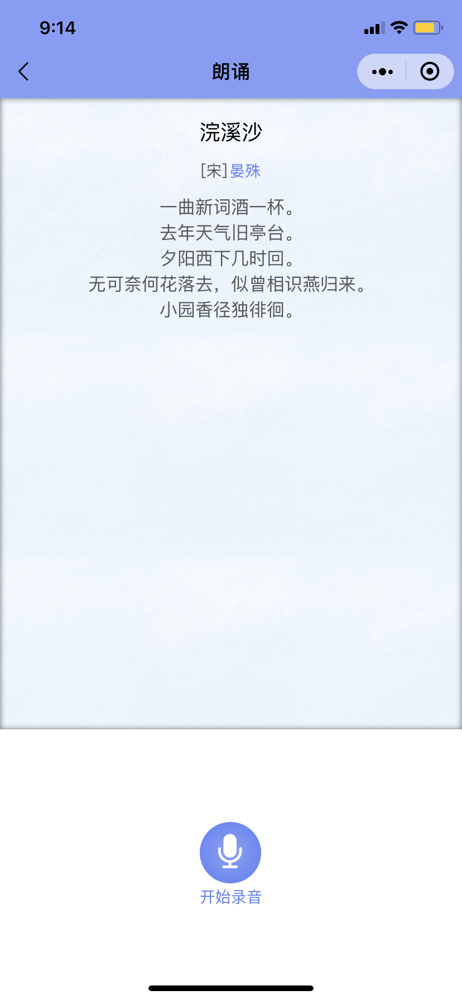|
|  搜索   | 搜索结果  | 登录 |
|   | 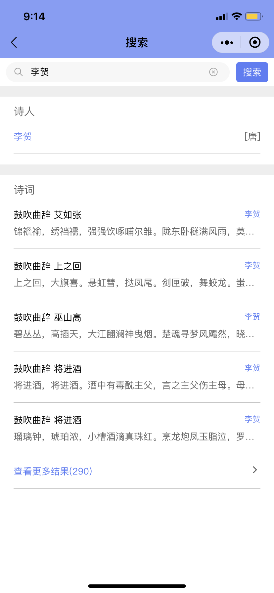 | 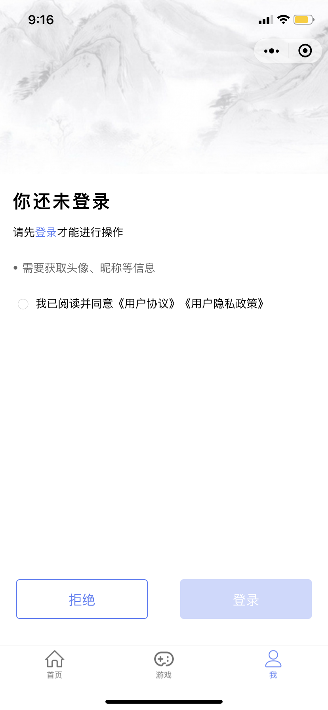 |
|  个人中心   | 诗词游戏  | 关卡 |
| 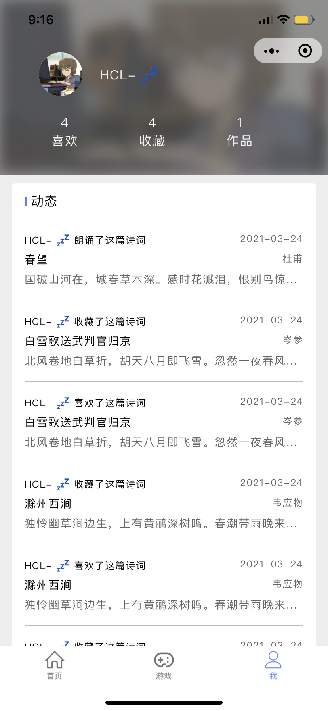  | 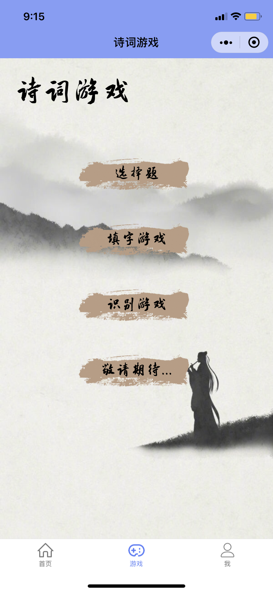 |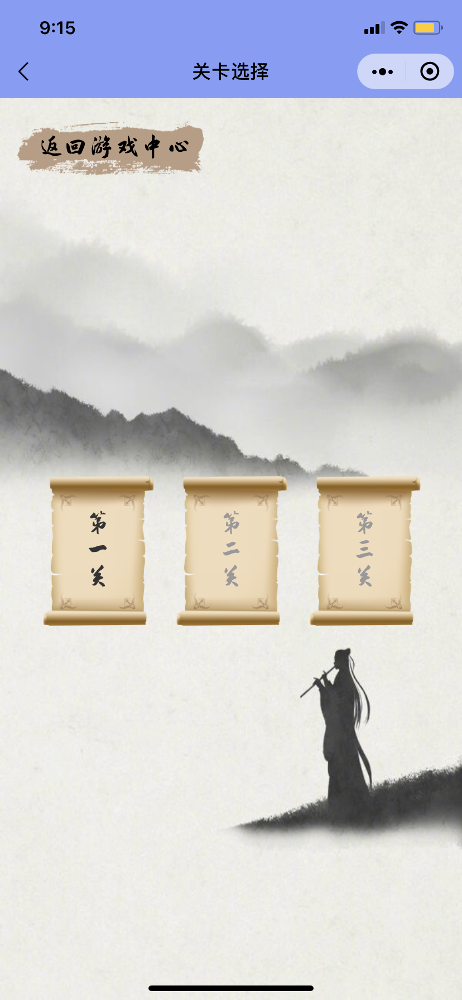|
|  选择题   | 填字游戏  | 识别游戏   |
| 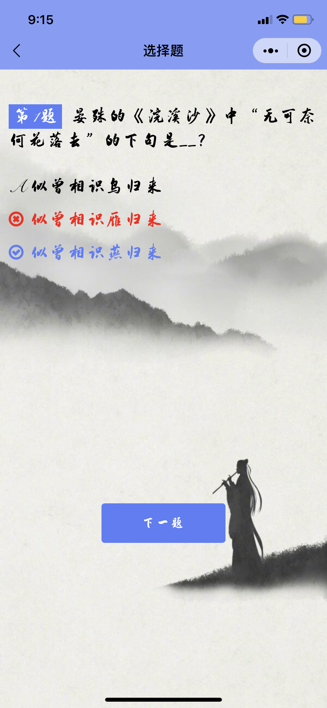  | 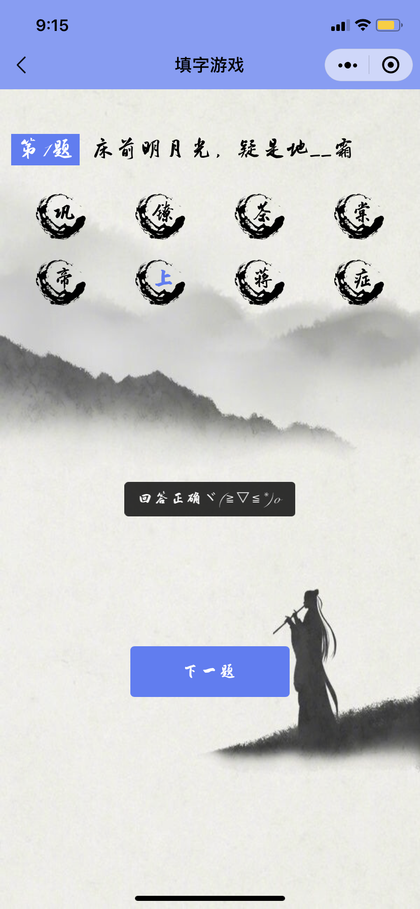 |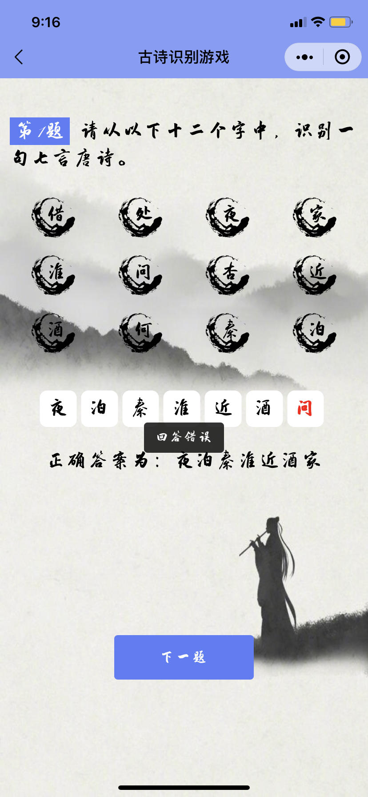  |
